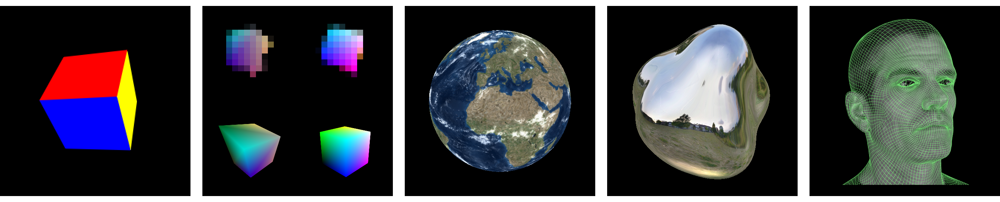

## Nvdiffrast &ndash; Modular Primitives for High-Performance Differentiable Rendering



**Modular Primitives for High-Performance Differentiable Rendering**<br>
Samuli Laine, Janne Hellsten, Tero Karras, Yeongho Seol, Jaakko Lehtinen, Timo Aila<br>
[http://arxiv.org/abs/2011.03277](http://arxiv.org/abs/2011.03277)

Nvdiffrast is a PyTorch/TensorFlow library that provides high-performance primitive operations for rasterization-based differentiable rendering.
Please refer to &#x261E;&#x261E; [nvdiffrast documentation](https://nvlabs.github.io/nvdiffrast) &#x261C;&#x261C; for more information.

## Licenses

Copyright &copy; 2020&ndash;2023, NVIDIA Corporation. All rights reserved.

This work is made available under the [Nvidia Source Code License](https://github.com/NVlabs/nvdiffrast/blob/main/LICENSE.txt).

For business inquiries, please visit our website and submit the form: [NVIDIA Research Licensing](https://www.nvidia.com/en-us/research/inquiries/)

We do not currently accept outside code contributions in the form of pull requests.

Environment map stored as part of `samples/data/envphong.npz` is derived from a Wave Engine
[sample material](https://github.com/WaveEngine/Samples-2.5/tree/master/Materials/EnvironmentMap/Content/Assets/CubeMap.cubemap)
originally shared under 
[MIT License](https://github.com/WaveEngine/Samples-2.5/blob/master/LICENSE.md).
Mesh and texture stored as part of `samples/data/earth.npz` are derived from
[3D Earth Photorealistic 2K](https://www.turbosquid.com/3d-models/3d-realistic-earth-photorealistic-2k-1279125)
model originally made available under
[TurboSquid 3D Model License](https://blog.turbosquid.com/turbosquid-3d-model-license/#3d-model-license).

## Citation

```
@article{Laine2020diffrast,
  title   = {Modular Primitives for High-Performance Differentiable Rendering},
  author  = {Samuli Laine and Janne Hellsten and Tero Karras and Yeongho Seol and Jaakko Lehtinen and Timo Aila},
  journal = {ACM Transactions on Graphics},
  year    = {2020},
  volume  = {39},
  number  = {6}
}
```
